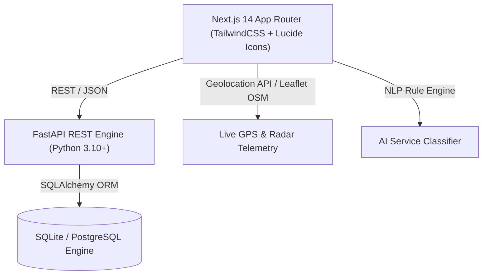

# Namma Sevai

### Connecting Skills with Community Needs

Namma Sevai is a smart cooperative platform that connects people with verified independent local workers for household, personal, community, and emergency services.

## 🚀 Features

- 👤 User registration and login
- 👨‍🔧 Independent worker registration
- 🛡️ Worker identity and skill verification
- 📍 Location-based nearby worker discovery
- 🧠 Smart worker matching
- 🗺️ Map and navigation support
- 📋 Service request and job management
- 💰 Transparent worker earnings
- ⭐ Ratings and reviews
- 🤝 Cooperative worker management
- 📊 Service demand analytics

## 🎯 Problem

People often need local skilled workers but may not know who is nearby, available, trustworthy, or qualified.

At the same time, many independent workers have skills but lack a digital platform to reach customers and receive job opportunities.

## 💡 Solution

Namma Sevai creates a digital ecosystem connecting customers, independent workers, and cooperatives.

The platform matches users with suitable workers based on:

- Location
- Required skill
- Availability
- Rating
- Verification
- Experience

## 🧠 Smart Automation

The platform can intelligently identify the required service from a user's request and recommend suitable nearby workers.

## 🤝 Cooperative Model

Workers can be associated with cooperative societies. Cooperatives can manage members, jobs, worker availability, earnings, and service demand.

## 🛠️ Technology Stack

- Next.js
- TypeScript
- Tailwind CSS
- FastAPI
- Python
- PostgreSQL
- Redis
- Google Maps Platform
- AI/ML

## 🔄 Workflow

User Request → Service Identification → Smart Matching → Verified Worker → Job Completion → Payment → Rating

## 🔐 Security

Sensitive worker verification documents are protected through role-based access control and are not publicly exposed.

Demo data should contain fictional information only.

## 📌 SIH

**Smart India Hackathon 2026**

**Problem Statement:** SIH26089  
**Ministry:** Ministry of Cooperation  
**Category:** Software  
**Theme:** Smart Automation

## 👥 Project

Namma Sevai aims to empower independent local workers while providing users with a trusted and convenient way to access local services.
# Avadi Connect (நம்ம சேவை)
### *Connecting Skills with Community Needs*

**Smart India Hackathon 2026 — Problem Statement SIH26089**  
**Ministry of Cooperation, Government of India**

---

## 📌 Executive Summary
**Avadi Connect** is a cooperative-owned digital service marketplace that connects households with verified, independent skilled workers (electricians, plumbers, carpenters, drivers, caregivers, appliance technicians, and more). 

Unlike extractive corporate gig aggregators that charge 25–35% platform commissions, Avadi Connect operates on a statutory **85-10-5 cooperative revenue model**:
- **85%** Direct worker take-home livelihood.
- **10%** Cooperative Welfare Fund (health insurance, skill certification, micro-pensions, child scholarship).
- **5%** Transparent platform maintenance and infrastructure operations.

---

## 🌟 Key Innovations & Features

### 1. 6-Factor Smart Matching Engine
Workers are ranked algorithmically using an objective, verifiable scoring formula:
$$\text{Score} = (0.30 \times \text{Skill}) + (0.25 \times \text{Proximity}) + (0.15 \times \text{Availability}) + (0.10 \times \text{Rating}) + (0.10 \times \text{Verification}) + (0.10 \times \text{Experience})$$

### 2. 4-Point Institutional Cooperative Verification
Every worker profile displays verified badges backed by cooperative audits:
- **Identity Check ✓**: Aadhaar / Government Photo ID validation.
- **Trade Skill Check ✓**: ITI certificate / NCVT / Cooperative master artisan endorsement.
- **Workplace Background ✓**: Police clearance & local cooperative society verification.
- **Mobile Handshake ✓**: Verified OTP & direct contact line.

### 3. Real-Time Live Location & Telemetry Tracking
- **Live GPS Tracking**: Native browser Geolocation API (`navigator.geolocation.watchPosition`) with high-accuracy mode.
- **Resilient Fallback Telemetry**: Automatic micro-drift simulation so live tracking demonstrations work reliably across any device or evaluation environment.
- **Interactive Radar Map**: Dual provider support (OpenStreetMap via Leaflet and Google Maps JS SDK), displaying worker proximity radar, live speed, heading, and distance-to-doorstep countdown.
- **Security OTP Handshake**: Secure 4-digit PIN generated for every dispatch; verified by worker on arrival to start the job.

### 4. Multilingual Experience (English & தமிழ்)
- Comprehensive English and Tamil bilingual dictionary across all 40 pages (`LanguageContext`).
- Instant 1-click language switcher in the primary navigation header.

### 5. AI Service Classification & Emergency SOS
- Natural language problem parser mapping freeform complaints (e.g. *"water leaking under bathroom sink"*) to exact service categories, required skills, and fair price estimates.
- 1-Click Emergency SOS modal for electrical sparking, burst pipes, puncture breakdown, and locksmith lockouts.

---

## 🏛️ System Architecture



- **Frontend**: Next.js 14 (App Router), TypeScript, Tailwind CSS, Lucide React, Canvas Confetti, Leaflet.
- **Backend**: FastAPI, Pydantic v2, SQLAlchemy, Uvicorn, Python 3.10+.
- **Database**: SQLite (`backend/kaushalsetu.db`) out-of-the-box with full PostgreSQL compatibility via `DATABASE_URL`.
- **State Management**: React Context (`AppContext` & `LanguageContext`) with localStorage persistence and API sync.

---

## 🗺️ 40 App Router Pages Directory

### 🌐 Public Pages
1. `/` — Avadi Connect Landing Page (Hero, 7-step cooperative workflow, testimonials, metrics)
2. `/about` — Ministry of Cooperation vision, bylaws, and 85-10-5 fee model
3. `/services` — Comprehensive service trade directory with pricing benchmarks
4. `/how-it-works` — Step-by-step visual guide for customers and workers
5. `/login` — Multi-role authentication (Customer, Worker, Cooperative, Admin)
6. `/register` — Citizen onboarding and role selection

### 👤 Customer Portal (`/customer/...`)
7. `/customer/dashboard` — Live location bar, AI request card, ranked worker preview, emergency SOS
8. `/customer/request-service` — Full service booking wizard with AI trade parsing
9. `/customer/nearby-workers` — Interactive Leaflet/Google map radar with live GPS filters
10. `/customer/worker/[id]` — Detailed worker profile, certificates, and ratings
11. `/customer/bookings` — Booking ledger with live status indicators
12. `/customer/bookings/[id]` — Real-time job tracker, live worker telemetry, and OTP
13. `/customer/payments` — Invoices with transparent 85-10-5 breakdown
14. `/customer/reviews` — Rate and review verified cooperative artisans
15. `/customer/profile` — Citizen account preferences, saved addresses, and language
16. `/customer/notifications` — Real-time service alerts and dispatch status

### 🛠️ Worker Portal (`/worker/...`)
17. `/worker/dashboard` — Live job offers, quick availability toggle, daily earnings
18. `/worker/register` — Worker onboarding and cooperative affiliation form
19. `/worker/profile` — Trade skills, tools owned, hourly rates, and bio
20. `/worker/verification` — 4-point institutional document upload and badge status
21. `/worker/jobs` — Active, pending, and past service job queue
22. `/worker/jobs/[id]` — Job lifecycle management (Accept, Navigate, Enter OTP, Complete)
23. `/worker/schedule` — Weekly appointment calendar and booking slots
24. `/worker/availability` — Real-time online/offline status switch
25. `/worker/earnings` — Transparent ledger of net 85% earnings and payout logs
26. `/worker/reviews` — Customer feedback, star ratings, and community reviews
27. `/worker/welfare` — Cooperative Welfare Fund passbook (insurance, micro-credit)
28. `/worker/notifications` — Instant job dispatch pings and announcements

### 🏢 Cooperative Portal (`/cooperative/...`)
29. `/cooperative/dashboard` — Society KPIs, active members, welfare balance, demand trends
30. `/cooperative/members` — Artisan roster with verification filter and trade stats
31. `/cooperative/members/[id]` — Document audit & 4-point institutional verification review
32. `/cooperative/jobs` — Society dispatch ledger and active disputes
33. `/cooperative/skills` — Upskilling courses, skill development, and training batches
34. `/cooperative/earnings` — 10% welfare fund collection ledger
35. `/cooperative/welfare` — Welfare disbursements (insurance claims, pensions)
36. `/cooperative/analytics` — Service completion metrics, revenue trends, worker ratings
37. `/cooperative/demand-forecast` — AI demand heatmaps and trade workforce shortages

### 🛡️ Platform Admin Portal (`/admin/...`)
38. `/admin/dashboard` — Platform-wide metrics, trade volume, regional cooperatives
39. `/admin/users` — User management and role permission controls
40. `/admin/workers` — Central worker registry and dispute escalation
41. `/admin/worker-verification` — Platform verification audits
42. `/admin/cooperatives` — Registered cooperative societies directory
43. `/admin/services` — Standard trade rate cards and category management
44. `/admin/jobs` — Platform-wide dispatch monitoring
45. `/admin/payments` — 85-10-5 escrow reconciliation
46. `/admin/reports` — Audit logs and compliance export
47. `/admin/settings` — System parameters, algorithm weights, and maintenance mode

---

## 🚀 Getting Started & Local Setup

### Prerequisites
- **Node.js**: v18.17+ or v20+
- **Python**: v3.10+ (for FastAPI backend)
- **Git**

---

### Step 1: Clone and Install Frontend
```bash
cd c:/Users/karthik/SIH
npm install
```

### Step 2: Run Frontend Development Server
```bash
npm run dev
```
The application will be accessible at: **`http://localhost:3000`**

---

### Step 3: Set Up and Run FastAPI Backend (Optional / Connected)
```bash
cd backend
python -m venv venv

# Windows PowerShell:
.\venv\Scripts\Activate.ps1
# Or Command Prompt:
.\venv\Scripts\activate.bat

pip install -r requirements.txt
uvicorn app.main:app --reload --port 8000
```
Backend API documentation (Swagger UI): **`http://localhost:8000/docs`**

---

## 🧪 Verification & Testing

### Frontend Type Safety
```bash
npx tsc --noEmit
```
*(Verified: 0 errors across all 40 App Router pages and components)*

### Backend Unit Tests
```bash
python backend/test_backend.py
```
*(Verified: 12 unit tests passing — Health, Workers, Cooperatives, Categories, Dispatch, Verification, Matching Engine, and 85-10-5 Split)*

---

## 👥 Demo Personas & Fast Switcher

| Persona | Role | Credentials | Access Portal |
| :--- | :--- | :--- | :--- |
| **Priya Sharma** | Customer | `customer@nammasevai.in` | `/customer/dashboard` |
| **Murugan K** | Worker (Electrician) | `worker@nammasevai.in` | `/worker/dashboard` |
| **Cooperative Secretary** | Cooperative Admin | `coop@nammasevai.in` | `/cooperative/dashboard` |
| **Ministry Admin** | Platform Admin | `admin@nammasevai.in` | `/admin/dashboard` |

*(Quick-switch role anytime using the role switcher in the header or via `/login`)*

---

## 📜 Statutory Compliance
Built strictly conforming to the guidelines of the **Ministry of Cooperation, Government of India**, promoting digital cooperative ecosystems under the vision of *"Sahakar Se Samriddhi"* (Prosperity through Cooperation).
